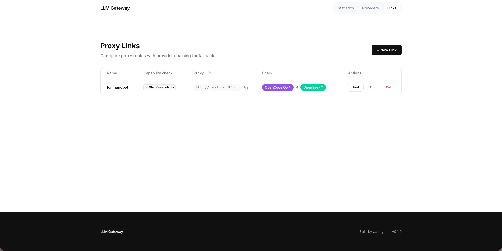
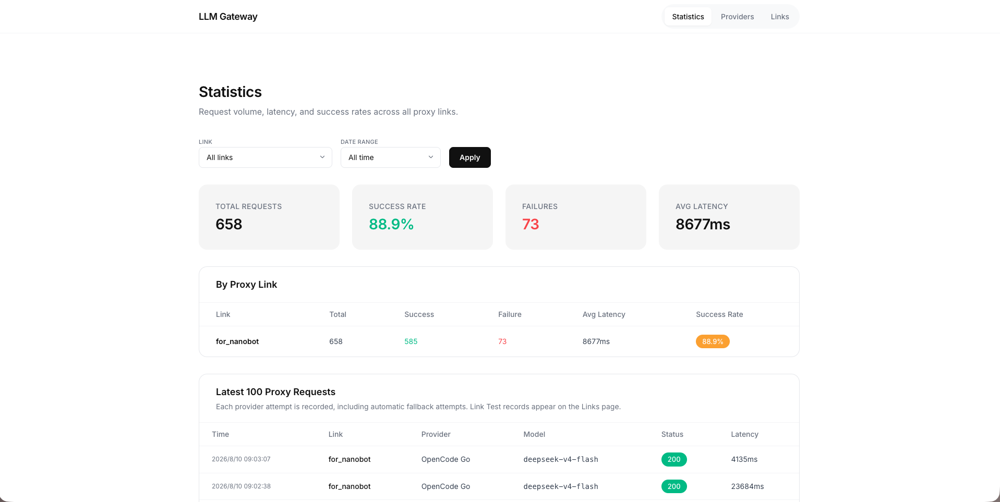

# UmbraGate

[中文](./README_zh.md)

> One reliable endpoint for every LLM.

**UmbraGate** is a self-contained LLM gateway that gives every AI client one OpenAI-compatible endpoint, while you choose the providers behind it. Route requests, fail over automatically, and see usage in one local web console—no Docker or database setup.

```bash
brew tap jachy-h/umbragate
brew trust --tap jachy-h/umbragate
brew install umbragate
umbragate start
# Open http://localhost:8787
```

## Quick start (for users)

1. Open **<http://localhost:8787>**.
2. Add API keys to the preconfigured providers, or create your own.
3. Create a link: put the provider with the best cost-performance first and a backup provider after it. UmbraGate automatically tries the backup if the first provider runs out of quota, is rate-limited, times out, or becomes unstable.
4. Paste the link URL into OpenCode, Cursor, a ChatGPT client, or any OpenAI-compatible client.

Your client uses one endpoint; UmbraGate handles routing and failover behind it.

## One console, from routing to proof

Create a proxy link, inspect its capability check, and make the chain visible before your clients use it.



Filter operational results by link and time range to see request volume, success rate, failures, latency, and recent provider attempts.



## For developers

Build from source with `make && ./umbragate run` (requires Go and Node.js).

- UmbraGate exposes one OpenAI-compatible endpoint to your application and routes requests through the providers configured in its link.
- It probes each OpenAI node for Chat Completions and Responses support, exposing only the formats common to the link. Anthropic Messages remains native.
- Call `/v1/chat/completions` or `/v1/responses` only when it appears in the link’s capability-check result. Anthropic-native nodes expose `/v1/messages`.
- Tag links by project or use case; hourly analytics aggregate request volume, success rate, latency, and provider attempts.

## Operations

All data—configuration and database—lives in `~/.umbragate/`; move that directory to migrate or reset a local installation. Startup prints the effective configuration path. The first-start configuration file documents every option.

By default, request logs are retained for 7 days; the database is capped at 1 GiB by pruning the oldest 1,000 request logs; and hourly aggregates are retained for 365 days. Background logs rotate daily or at 50 MiB and retain seven compressed backups.

```bash
umbragate start
umbragate status
umbragate restart
umbragate stop
umbragate run
umbragate --help
umbragate version # or: umbragate -v
```

`start` runs in the background; `run` runs in the foreground. After a background start, `start` and `status` print the Web UI URL. Running `start` while UmbraGate is already running shows its status instead of failing. Both modes use `~/.umbragate/config.yaml` by default. Use a custom configuration with `umbragate start -config /path/to/config.yaml`, `umbragate restart -config /path/to/config.yaml`, or `umbragate run -config /path/to/config.yaml`.

Runtime files are stored in `~/.umbragate/`: `umbragate.pid` records the background process, `umbragate.url` records the Web UI URL, and `umbragate.log` contains its output. Running `umbragate` without a command displays help; use `umbragate run` to run in the foreground.

## Release verification

Every release is validated before publication: CI builds the React frontend, verifies that it is embedded, compiles the Go binary, and runs the Go test suite. Release archives contain the self-contained binary and `config.yaml` for Apple Silicon and Intel Macs.

---

[Admin API reference](https://github.com/jachy-h/umbragate) &nbsp;|&nbsp; [中文](./README_zh.md)
